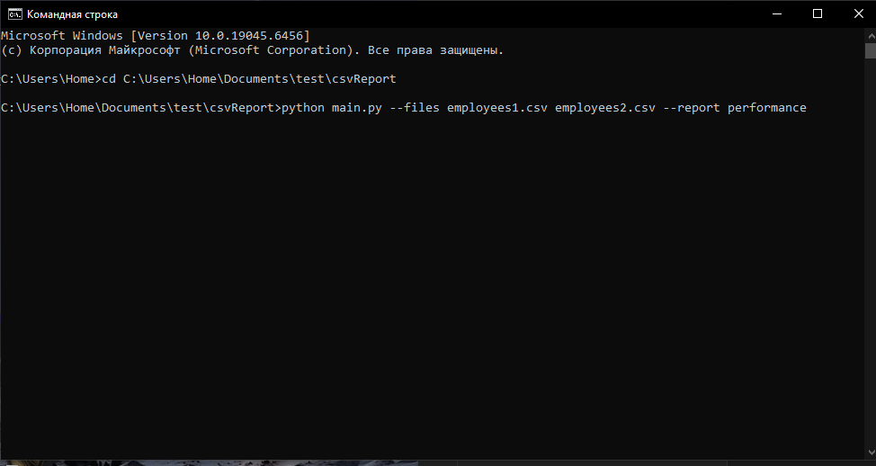
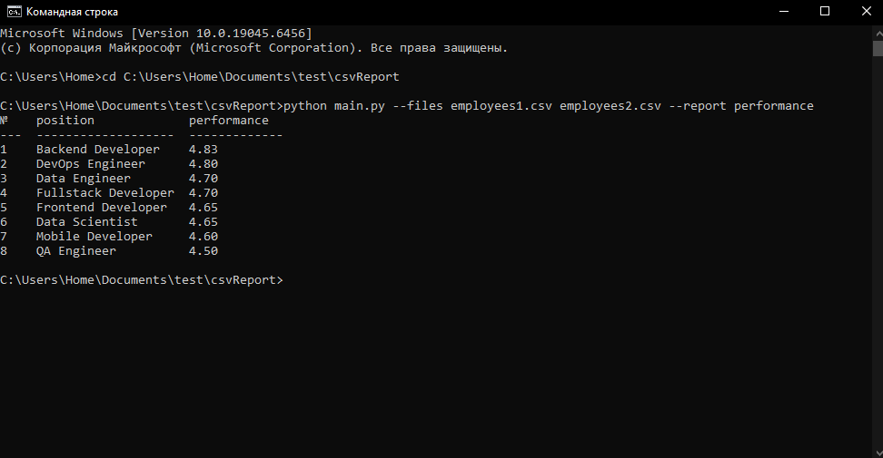

Добавление нового отчета производится в классе Report. 
Для этого необходимо добавить новый staticmethod(название функции
должно соответствовать названию отчета) который принимает
прочитанные данные из csv файла и возвращает Список заголовков отчёта
и данные отчета в формате List[List[Any]]

для запуска скрипта ввести команду в формате 

python main.py --files (путь к файлу или нескольким файлам csv) --report (название отчета)

python main.py --files employees1.csv employees2.csv --report performance

результат выполнения
!